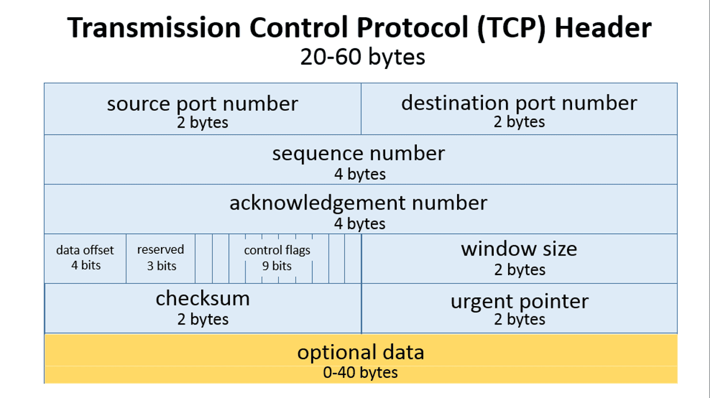

# Tugas 1 IF3130 jaringan Komputer
#
## Petunjuk Penggunaan Program
Untuk menggunakan program ini caranya adalah dengan mengetikkan command:
make

Kemudian menjalankan kedua command berikut pada proses yang berbeda :
./recvfile <filename> <windowsize> <buffersize> <port>
   
./sendfile data/<filename> <windowsize> <buffersize> <destination_port>

## Cara kerja Sliding Window

Pada sliding window data akan dikirimkan dibungkus dalam frame-frame dimasukkan ke dalam buffer sampai buffer penuh ataupun semua data dimasukkan.
Apabila ukuran buffer sudah penuh, maka buffer akan memblok data yang ingin masuk ke buffer.
Frame-frame yang sudah dimasukkan ke buffer akan dikirimkan dengan menggunakan Window.
Window mempunyai ukuran yang membatasi ukuran frame yang boleh dikirimkan dalam sekali pengiriman.
Apabila suatu frame berhasil dikirimkan ke penerima, maka penerima akan mengirimkan ACK (Acknowledgement), semacam pemberitahuan bahwa data sudah dikirimkan dan penerima meminta frame berikutnya.
Semua frame pada suatu Window harus selesai dikirimkan baru Window akan "bergeser", yaitu bergerak sejauh ukuran Window untuk mengirimkan frame berikutnya.

## Pembagian tugas
**13515041 - Leo Lambarita Nadeak**:
Membuat algoritma transfer data

**13515053 - Yohanes Jhouma**:
Membuat struktur data Frame

**13515095 - Rizki Halasan**:
Membuat struktur data Window dan membuat laporan

## Pertanyaan
1. Apa yang terjadi jika advertised window yang dikirim bernilai 0? Apa cara untuk menangani hal tersebut?
2. Sebutkan field data yang terdapat pada TCP Header serta ukurannya, ilustrasikan, dan jelaskan kegunaan dari masing-masing field data tersebut

## Jawaban
1. Apabila advertised window yang dikirim bernilai 0, maka itu berarti buffer penerima penuh sehingga data tidak akan dikirim dulu.
   Cara menangani hal tersebut adalah dengan mengirim data yang terdapat pada buffer penerima ditulis di file eksternal.
2. Ilustrasi TCP Header

**source port number** untuk menandai endpoint pada pengirim

**destination port number** untuk menandai endpoint pada penerima

**sequence number** untuk penanda (semacam nomor urut) dari message

**acknowledgement number** untuk mengecek apakah data yang dikirim pengirim sama dengan data yang diterima penerima

**data offset** untuk menyimpan total ukuran TCP header

**reserved** selalu berisi nilai 0, untuk membuat jumlah ukuran TCP header selalu kelipatan 4

**control flags** untuk mengatur aliran data

**window size** untuk mengatur seberapa banyak data yang dikirimkan ke penerima sebelum mendapatkan acknowledgement

**checksum** untuk membantu penerima mendeteksi pesan yang tidak tepat

**urgent pointer** sering diset dengan angka 0 dan tidak diabaikan, bisa digunakan sebagai data offset

**optional data** untuk mendukung special acknowledgement
